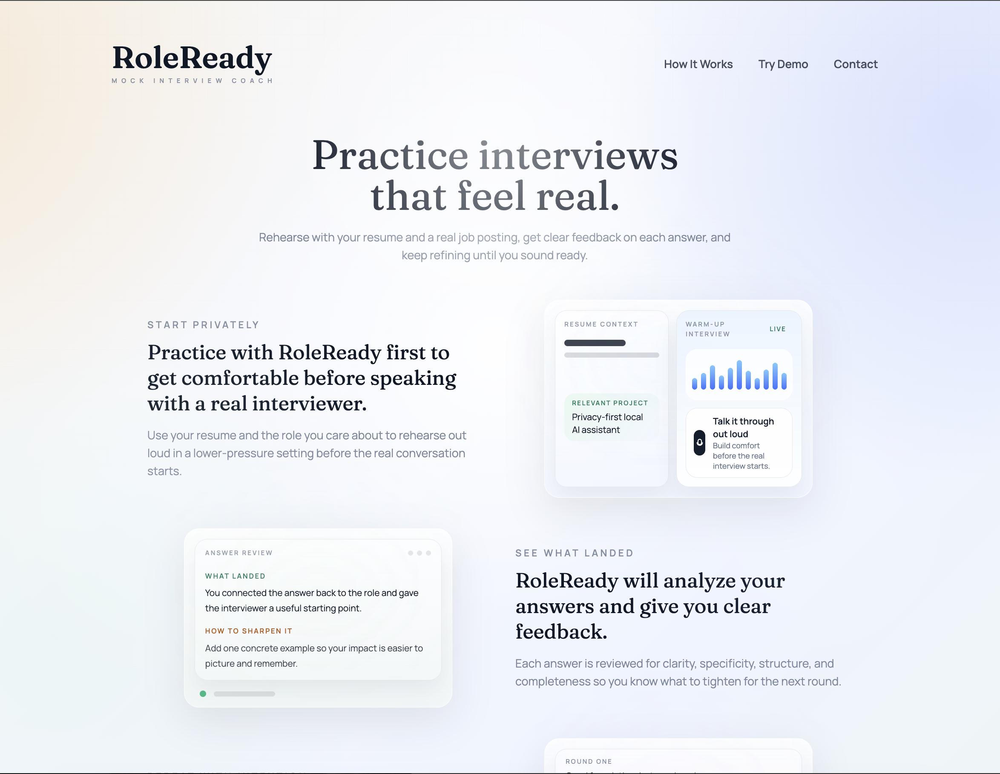
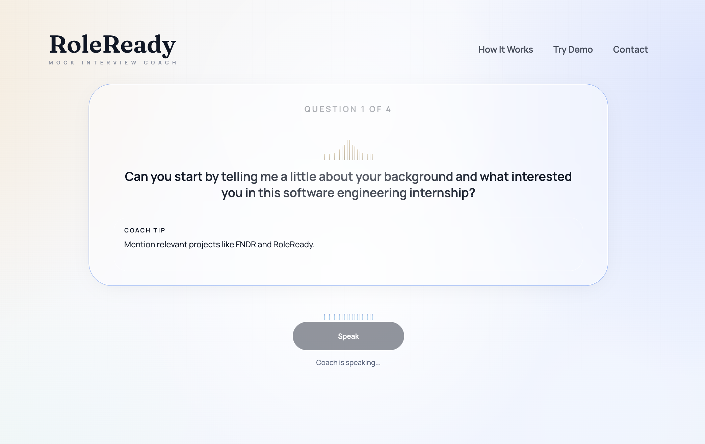

# ConnectRole — AI Mock Interview Coach

ConnectRole is a premium, high-fidelity mock interview platform designed to help candidates practice for specific roles using their own background and target job descriptions. Built with **Next.js**, **Tailwind CSS**, and **TypeScript**, it leverages advanced LLMs to provide a realistic, adaptive, and supportive interview experience.




## ✨ Key Features

- **Personalized Setup**: Upload your PDF resume and paste a job posting to generate an interview tailored specifically to you.
- **Adaptive AI Interviewer**: The coach analyzes your answers in real-time, asking relevant follow-up questions and probing deeper into your skills.
- **Voice Selection**: Choose between professional male (Mark) and female (Rachel) voices for your interviewer.
- **Live Feedback & Coaching**: Get instant "Coach Tips" during the interview to help you structure your answers more effectively.
- **Comprehensive Results**: Receive a detailed performance report after each session, including:
  - **Strengths**: What you did well.
  - **Areas for Improvement**: Specific, actionable advice.
  - **Sample Answers**: High-quality examples of how to improve your specific responses.
  - **Skill Scoring**: Metrics on relevance, specificity, confidence, and role alignment.
- **Premium Design**: A smooth, modern UI with glassmorphism, fluid animations, and a focus on clarity.

## 🚀 Getting Started

### Prerequisites

- Node.js 18.x or later
- An API Key for one of the supported LLM providers (OpenAI or Groq)
- A Google Cloud TTS API Key (optional, for high-quality voice)

### Installation

1. **Clone the repository**:
   ```bash
   git clone https://github.com/felipemarin-16/ConnectRole.git
   cd ConnectRole
   ```

2. **Install dependencies**:
   ```bash
   npm install
   ```

3. **Configure Environment Variables**:
   Create a `.env.local` file in the root directory:
   ```bash
   cp .env.example .env.local
   ```
   Fill in your API keys (e.g., `OPENAI_API_KEY` or `GROQ_API_KEY`).

4. **Run the development server**:
   ```bash
   npm run dev
   ```
   Open [http://localhost:3000](http://localhost:3000) with your browser to see the result.

## 🛠 Technology Stack

- **Framework**: [Next.js](https://nextjs.org/) (App Router)
- **Styling**: [Tailwind CSS](https://tailwindcss.com/)
- **Voice Output (TTS)**: [Google Cloud Text-to-Speech](https://cloud.google.com/text-to-speech) (for the coach's voice)
- **Speech Recognition (STT)**: Browser Web Speech API (runs free and locally in the browser, **no Whisper API needed**)
- **AI/LLM**: [OpenAI](https://openai.com/) or [Groq](https://groq.com/) (used strictly to generate smart interview questions and feedback)
- **PDF Parsing**: Client-side text extraction

## 📝 License

This project is licensed under the MIT License - see the [LICENSE](LICENSE) file for details.

Built with ❤️ by [Felipe Marin](https://github.com/felipemarin-16).
